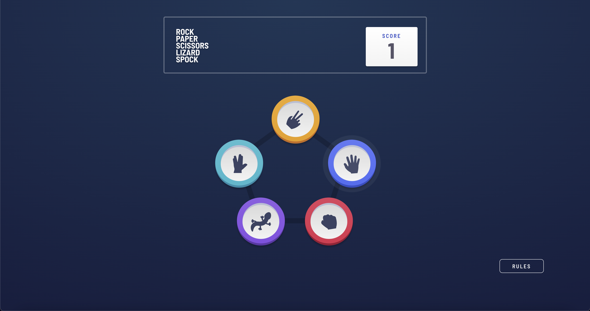
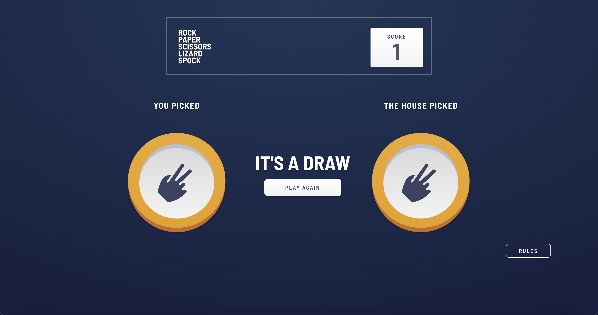
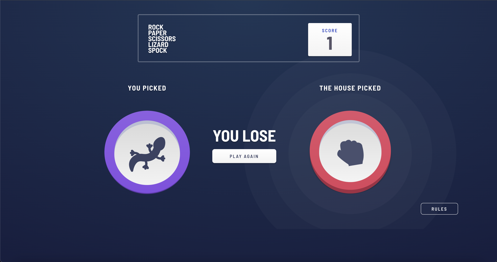

# Frontend Mentor - Rock, Paper, Scissors, Lizard, Spock solution

Not sure what Rock, Paper, Scissors, Lizard, Spock is? 
- [Check out this clip from The Big Bang Theory](https://www.youtube.com/watch?v=iSHPVCBsnLw)

This is a solution to the [Rock, Paper, Scissors, Lizard, Spock challenge on Frontend Mentor](https://www.frontendmentor.io/challenges/rock-paper-scissors-game-pTgwgvgH). Frontend Mentor challenges help you improve your coding skills by building realistic projects. 

## Table of contents

- [Overview](#overview)
  - [The challenge](#the-challenge)
  - [Screenshot](#screenshot)
  - [Links](#links)
- [My process](#my-process)
  - [Built with](#built-with)
- [Author](#author)
- [Acknowledgments](#acknowledgments)

**Note: Delete this note and update the table of contents based on what sections you keep.**

## Overview

### The challenge

Users should be able to:

- View the optimal layout for the game depending on their device's screen size
- Play Rock, Paper, Scissors, Lizard, Spock against the computer
- Maintain the state of the score after refreshing the browser
- See hover and focus states for all interactive elements on the page

### Screenshot
 
 
 

### Links

- [Solution URL](https://github.com/AnnaofAmber/Rock-Paper-Scissors-Lizard-Spock-game)
- [Live Site URL](https://your-live-site-url.com)

## My process

### Built with

- Semantic HTML5 markup
- SCSS custom properties
- Flexbox
- Mobile-first workflow
- [React](https://reactjs.org/) - JS library
- [Redux](https://redux.js.org/) - For state management
- [CSS Modules](https://github.com/css-modules/css-modules) - For styles
- [clsx](https://www.npmjs.com/package/clsx) - For using classes conditionally 

## Author

- LinkedIN - [Anna Boichuk](https://www.linkedin.com/in/anna-boichuk-a6a050238)
- Frontend Mentor - [@AnnaofAmber](https://www.frontendmentor.io/profile/AnnaofAmber)
- GitHub - [@AnnaofAmber](https://github.com/AnnaofAmber)

